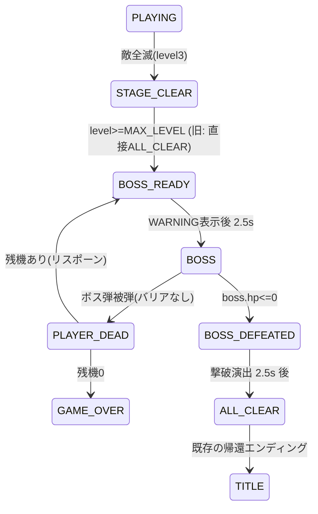

# 設計書

> 本書は `.steering/20260606-boss-stage/requirements.md`（合意済み）の設計フェーズ成果物。
> 「ステージ3クリア後のHP制ボスステージ」を、既存のゼロ依存・Canvas・60fps・フェーズ駆動アーキテクチャに最小侵襲で組み込む。

## アーキテクチャ概要

### 採用方針: 「専用フェーズ」方式（`level==4` 特殊面方式は不採用）

ボスステージは **新フェーズ群（`BOSS_READY` / `BOSS` / `BOSS_DEFEATED`）** として表現する。
ボス固有のロジックは新規 `BossManager`（`src/boss.ts`）に凝集する。既存 `GhostManager`/`FruitManager`/`LaserManager`/`PlayerManager` は再利用し、ボス戦に必要な最小拡張のみ行う。

**なぜ専用フェーズか（最重要判断）**:

`level==4` の通常面として吸収する案も検討したが、以下の理由で却下した。

1. **クリア条件が根本的に異なる**: 通常面は `ghostMgr.allDefeated()` でクリア。ボス戦は `boss.hp<=0`。`updatePlaying()` に `if (level===4)` を差し込むと、PLAYING の最重要ロジック（ドット・敵AI・詰み防止フルーツ・クリア判定）に異物が混入し、リグレッション面が広がる。
2. **敵の概念が異なる**: 通常面は4体のエイリアン（取り巻き）。ボス戦は取り巻きなしの単体・HP制。`GhostManager` をボス用に流用すると意味論が崩れる。
3. **既存の `switch(state.phase)` / `render()` ディスパッチ流儀に最も整合**: フェーズを足して分岐を1ブロック追加するのは、`INTRO`/`STAGE_CLEAR`/`ALL_CLEAR` を足してきた既存の拡張パターンそのもの。テストも `gameflow.test.ts` の流儀（フェーズ遷移の単体検証）にそのまま乗る。
4. **`level` 値を汚さない**: `MAX_LEVEL=3` / `TOTAL_PARTS=MAX_LEVEL` を据え置ける。部品3個・HUD・ハイスコアの既存挙動を一切壊さない。

**遷移の接続点**: `startNextLevel()` で `level>=MAX_LEVEL` のとき、現在は即 `ALL_CLEAR` へ飛ぶ。ここを **`BOSS_READY` へ差し替える**。ボス撃破後（`BOSS_DEFEATED` の演出終了時）に従来どおり `ALL_CLEAR`（帰還エンディング）へ接続する。これにより「ステージ3クリア→ボス戦→撃破→帰還エンディング」が一直線に繋がる。



### コンポーネント関係図

```
GameLoop (switch(phase) に BOSS_READY/BOSS/BOSS_DEFEATED を追加)
  │
  ├─ updateBoss(dt)  ← 新規。ボス戦1フレームの統括
  │     ├─ player.update(...)        （既存・左右移動で弾を避ける）
  │     ├─ fruitMgr.updateSpawning/update（既存・enemiesRemain = boss生存 でレーザー供給）
  │     ├─ laser.update(...)          （既存・進行方向=上方へ連射）
  │     │     └─ boss.hitByBeams(laser.getBeams())  ← 新規。ビーム座標を流用しHP減算
  │     ├─ boss.update(dt, playerPixelPos)  ← 新規。弾幕発射・弾移動
  │     ├─ boss.checkPlayerHit(playerPixelPos, player.hasBarrier()) ← 新規。被弾→die()
  │     └─ パワーエサ取得でバリア展開（既存。ただしボス盤面にPOWER_DOTを配置）
  │
  └─ Renderer.render に BOSS_* 分岐追加
        ├─ drawBossArena()    新規・ボス戦専用盤面
        ├─ drawBoss(boss)     新規・巨大エイリアン本体
        ├─ drawBossBullets()  新規・弾幕
        ├─ drawBossHpBar()    新規・HP UI
        └─ drawBossWarning() / drawBossDefeated()  新規・導入/撃破演出

BossManager (src/boss.ts) ← 新規。HP・弾幕プール・被弾判定を1クラスに凝集
```

## コンポーネント設計

### 1. BossManager（新規 `src/boss.ts`）

**責務**:
- ボスのHP管理（初期HP・ダメージ適用・撃破判定）。
- 弾幕の生成・前進・寿命管理（固定長プールで GC スパイク回避）。
- プレイヤー弾（レーザービーム座標）によるHP減算判定。
- ボス弾によるプレイヤー被弾判定（バリア中は無効）。
- ボス本体の座標・左右往復の挙動（盤面上部）。

**公開インターフェース（案）**:
```typescript
export interface BossBullet {
  active: boolean;
  x: number; y: number;   // 盤面ローカル座標(px)（laser/particle と同じ系。描画側で MAP_OFFSET_Y 加算）
  vx: number; vy: number; // px/フレーム相当ではなく px/秒（update で dt 乗算）
}

export class BossManager {
  readonly maxHp: number;
  get hp(): number;
  get isDefeated(): boolean;          // hp <= 0
  get centerPixel(): Vec2;            // 本体中心(盤面ローカル, px)。被弾原点・HP UI位置算出に使う

  reset(): void;                      // HP満タン・弾全消去・位置初期化・タイマー0
  update(dt: number): void;          // 本体の左右往復＋弾幕パターン発射＋全弾前進＋場外/壁消滅
  hitByBeams(beams: Beam[]): number; // レーザービームのうち本体円に当たった数だけHPを減算し、消したビーム数 or 与ダメを返す
  checkPlayerHit(playerPixelPos: Vec2, hasBarrier: boolean): boolean; // 当たり&バリアなし→true(=ミス)。当たった弾は消す
  getBullets(): BossBullet[];         // 描画用（active のみ）
  getHpRatio(): number;               // 0..1（HPバー描画用）
}
```

**実装の要点**:
- **固定長プール**: `BossBullet[]` を `MAX_BULLETS`（後述、48）で初期化し `active` フラグで再利用。`LaserManager` の `beams` プールに倣う。`getBullets()`/`getBeams()` 同様 `filter` は描画時のみ。
- **座標系は盤面ローカル**（`laser.ts`・`particles` と同じ）。描画側で `MAP_OFFSET_Y` を加算。ヒット判定もこの系で完結させ、`renderer` に判定ロジックを置かない（責務分離: Update が判定、Render は描画のみ）。
- **HP減算は `hitByBeams` に集約**: `LaserManager.update()` 内で敵を撃つ既存処理（`ghostMgr.defeatAt`）はボス戦では呼ばれない（ボス盤面に ghost はいない）。代わりに `gameLoop.updateBoss()` が `boss.hitByBeams(laser.getBeams())` を呼ぶ。当たったビームは命中後 `active=false` にして貫通を防ぐ（1ビーム1ヒット、laser の既存挙動と一致）。
- **被弾は「弾1発消費」**: `checkPlayerHit` で当たった弾は消す。バリア中は当たっても消すがミスにしない（盾で弾けた表現）。
- **例外を投げない**: ゲームループ内なので `try/catch` 不要だが、配列外参照や NaN を生まない実装にする（`development-guidelines.md` のエラーハンドリング方針）。

### 2. GameLoop 拡張（`src/gameLoop.ts`）

**責務**:
- `BOSS_READY` / `BOSS` / `BOSS_DEFEATED` の3フェーズを `switch(state.phase)` に追加。
- `startNextLevel()` の `level>=MAX_LEVEL` 分岐を `ALL_CLEAR` から `startBossStage()`（`BOSS_READY` へ）に差し替え。
- `updateBoss(dt)` でボス戦1フレームを統括。
- ボス被弾→`PLAYER_DEAD`（既存導線を流用、残機0で `GAME_OVER`）。
- リスポーン（`respawnPlayer`）がボス戦中なら `BOSS_READY` へ戻す（ボスHPは保持＝削った分は維持。理由は後述「バランス」）。

**実装の要点**:
- **`BossManager` を `GameLoop` のフィールドに追加**（`private boss = new BossManager();`）。`particles`/`laser` と同じ持ち方。
- **`main.ts` は変更最小**: `BossManager` を `GameLoop` 内部で生成すれば、`main.ts` の依存組み立て（8引数）に手を入れずに済む。`particles`/`laser` が既に内部生成である前例に従う。
- **被弾→ミスの導線**: 既存の `PLAYER_DEAD` ロジック（`lives--`、残機0で `GAME_OVER`、ハイスコア保存）をそのまま流用。`respawnPlayer()` にボス戦分岐（`state.phase` が BOSS 系なら `BOSS_READY` へ）を1つ追加。
- **クリア（撃破）→ ALL_CLEAR**: `BOSS_DEFEATED` フェーズのタイマーが規定（`BOSS_DEFEATED_DURATION`）を超えたら `state.phase='ALL_CLEAR'`、`phaseTimer=0`、`dotsEaten=0`（既存 `startNextLevel` の ALL_CLEAR 突入と同じ初期化）。ハイスコアもここで `storage.setHighScore` する（既存STAGE_CLEAR/撃破時の流儀）。
- **詰み防止**: ボス生存中は `fruitMgr.updateSpawning(dt, enemiesRemain=true, ...)` でフルーツを供給し続け、レーザーが枯れないようにする（既存の詰み防止と同じ思想）。ボス盤面の `getValidFruitPositions()` が空にならない盤面設計にする（後述）。

### 3. Renderer 拡張（`src/renderer.ts`）

**責務**:
- `render()` の `switch(state.phase)` に `BOSS_READY` / `BOSS` / `BOSS_DEFEATED` を追加。
- ボス戦専用の描画一式（盤面・ボス本体・弾幕・HPバー・WARNING導入・撃破演出）。

**実装の要点**:
- **既存の描画ヘルパーを再利用**: `glowText`（テキスト）、`drawPlayer`/`drawBarrierRing`（プレイヤーとバリア）、`drawLaser`（レーザー）、`drawFruit`（フルーツ）、`roundRectPath`、パーティクル（最前面）。これらはフェーズ非依存に呼べる。
- **ボス本体 `drawBoss`**: `drawGhost` の巨大版として宇宙テーマで描き起こす（ドーム頭＋波打つ触手の下端＋大きな目）。`GHOST_COLORS` 系の赤系＋グローで「ラスボス」感。HP低下で色や脈動を変える（任意）。座標は `boss.centerPixel` + `MAP_OFFSET_Y`。
- **弾幕 `drawBossBullets`**: 加算合成（`drawLaser` と同じ `lighter`）で発光する弾。`boss.getBullets()` を走査し小円＋グロー。
- **HPバー `drawBossHpBar`**: 盤面上部（UI行の下、ボスの真上あたり）に `roundRectPath` で枠＋ `boss.getHpRatio()` 比率の塗り。残量で色を変える（緑→黄→赤）。`glowText` で `BOSS` ラベル。
- **WARNING導入 `drawBossWarning`**: `drawIntro` の警告ヘッダ（点滅する赤 `⚠ WARNING`）の流儀で「BOSS APPROACHING」等を中央に。`drawPanel` で帯を敷く。
- **撃破演出 `drawBossDefeated`**: 爆散（`drawDeadPlayer` の shard 表現を流用）＋ホワイトアウト気味のフラッシュ。撃破スパークは `particles.spawnBurst` を `gameLoop` 側で発火。
- **`render()` から `GameState` を変更しない**（既存規約厳守）。ボスの状態は `BossManager` が単一の真実。

### 4. 定数集約（`src/constants.ts`）

**責務**: ボス戦の全マジックナンバーを集約（`development-guidelines.md`「マジックナンバーは constants.ts」）。

**追加する定数（値は仮。根拠は「データフロー/バランス」節）**:
```typescript
// --- ボスステージ ---
export const BOSS_READY_DURATION    = 2.5;  // WARNING導入の表示時間(秒)
export const BOSS_DEFEATED_DURATION = 2.5;  // 撃破演出→ALL_CLEAR への猶予(秒)

export const BOSS_MAX_HP   = 60;            // 初期HP（必要ヒット数の目安: 後述）
export const BOSS_HIT_DAMAGE = 1;           // レーザー1ヒットの与ダメ
export const BOSS_BODY_RADIUS = TILE_SIZE * 1.6; // 本体の被弾円半径(px)。大きめで当てやすく

export const BOSS_SWAY_SPEED  = 2.2;        // 本体の左右往復速度(tiles/秒相当)
export const BOSS_SWAY_RANGE  = TILE_SIZE * 4; // 往復の片振幅(px)

export const BOSS_BULLET_SPEED   = 6.0;     // 弾速(tiles/秒)。プレイヤー6.0と同等で「避けられる」速度
export const BOSS_BULLET_RADIUS  = TILE_SIZE * 0.42; // 弾の被弾半径(px)
export const BOSS_FIRE_INTERVAL  = 0.9;     // 弾幕1ウェーブの発射間隔(秒)
export const BOSS_SPREAD_COUNT   = 5;       // 1ウェーブのばら撒き弾数(扇状)
export const BOSS_SPREAD_ARC     = Math.PI * 0.5; // 扇の開き角(rad)
export const BOSS_AIMED_INTERVAL = 1.8;     // 狙い撃ち弾の発射間隔(秒)。ばら撒きと別タイマー
export const BOSS_MAX_BULLETS    = 48;       // 弾プール上限(固定長)
```

**実装の要点**:
- `MAX_LEVEL`/`TOTAL_PARTS`/`getLevelParams` は **変更しない**。ボス戦は `level` を進めない（`level` は3のまま）。
- ボス盤面用の色は `STAGE_WALL_COLORS` とは別に1エントリ（赤系の「最終決戦」配色）を `constants` に持つか、`getStageColors` を拡張せず専用定数で持つ。既存3ステージの色割り当てを壊さないため **専用定数 `BOSS_ARENA_COLORS` を新設**する。

### 5. 型定義拡張（`src/types.ts`）

**責務**: `GamePhase` にボス用フェーズを追加。必要なら `SoundKey` にボス用SEを追加。

```typescript
export type GamePhase =
  | 'TITLE' | 'INTRO' | 'READY' | 'PLAYING' | 'PAUSED'
  | 'PLAYER_DEAD' | 'STAGE_CLEAR'
  | 'BOSS_READY' | 'BOSS' | 'BOSS_DEFEATED'   // ← 追加
  | 'ALL_CLEAR' | 'GAME_OVER';
```

**SE方針**: 既存SEで賄うのを基本とする（`development-guidelines.md`「既存資産流用」、requirements スコープ外「新規アセット追加なし」）。
- ボス被弾（プレイヤーミス）= 既存 `DEATH`。
- レーザーがボスにヒット = 既存 `EAT_GHOST`。
- ボス撃破 = 既存 `FANFARE`（エンディング接続の高揚と整合）。
- ボス登場の `WARNING` = 既存 `GAME_START` で代替（または無音）。

→ **`SoundKey` への新規追加は行わない**（型・audio 実体・アセットの追加が連鎖し、スコープ外に触れるため）。将来差し替えたくなったら「将来の拡張性」節の通り。

### 6. ボス盤面（マップ）

**方針**: 専用レイアウトを **`map.ts` 側に追加せず**、`Renderer.drawBossArena()` で軽量に描く。
理由: ボス戦のプレイヤー移動は「下部で左右に動いて避ける」ことが主眼で、複雑な迷路は不要。むしろ迷路があるとレーザーが壁に阻まれ上方のボスに届かない（laser は壁で消滅する）。

- **盤面**: 外周のみ壁、内部は概ね開けた「闘技場」。プレイヤーは下部の広い空間を左右に動ける。レーザーは上方向へ遮蔽なく飛ぶ。
- **実装手段**: `MapManager` に `buildBossArena()` を1メソッド追加し `reset()` 同様に専用タイル配列を構築する。`isWall`/`isTunnel`/`getValidFruitPositions`/`drawTo`/`drawDots` の既存APIをボス盤面でもそのまま使えるようにする（=ボス戦も `MapManager` を真実とする）。これにより laser の壁判定・fruit の有効位置・プレイヤーの衝突がすべて既存ロジックで動く。
- **POWER_DOT 配置**: 下部の左右端などに数個。プレイヤーが取りに動く＝弾を避ける動線になり、取得でバリア（盾）が張れる。バリアの供給源として必須。
- **DOT 配置**: ボス戦はドット収集をクリア条件にしないが、`map.drawDots`/`eatDot` はそのまま動く。スコア源として薄く撒くか、空にするかは実装時に決定（空でも可。`getValidFruitPositions` がフルーツ用に十分な通路を返せれば良い）。

**実装の要点**:
- `getValidFruitPositions()` がボス盤面で空配列を返さないこと（詰み防止の前提）。闘技場は通路が広いので問題にならないが、テストで連結性/非空を確認する。

## データフロー

### ユースケース1: ステージ3クリア → ボス戦突入
```
1. updatePlaying() で ghostMgr.allDefeated() が真（level=3）
2. partsCollected=3, phase='STAGE_CLEAR'（既存どおり。部品3/3で頭打ち）
3. CLEAR_DURATION 経過 → startNextLevel()
4. level>=MAX_LEVEL なので startBossStage() を呼ぶ（旧: phase='ALL_CLEAR'）
5. startBossStage(): phase='BOSS_READY', phaseTimer=0,
   map.reset(BOSS) でボス闘技場構築, player.reset, fruitMgr.reset, laser.reset,
   boss.reset()（HP満タン）, audio.play('GAME_START')
6. BOSS_READY_DURATION 経過 → phase='BOSS'
```

### ユースケース2: ボス戦1フレーム（updateBoss）
```
1. 入力反映: player.setNextDir / player.update（左右移動）
2. パワーエサ取得判定 → player.activateBarrier（既存と同じ仕組み）
3. フルーツ供給: fruitMgr.updateSpawning(dt, enemiesRemain=!boss.isDefeated, ...) / update → 取得で laser.activate()
4. レーザー前進: laser.update(...)（ghostMgr 引数には何も撃たれない or ボス戦専用に空処理）
   ※ laser.update は ghostMgr.defeatAt を呼ぶため、ボス戦では「敵ゼロのGhostManager」を渡しても害がない
     （allDefeated 初期状態でも defeatAt は誰にも当たらず0を返す）。HP減算は次行で別途行う。
5. boss.hitByBeams(laser.getBeams()) → 命中ビームを消しHP減算、与ダメ>0なら audio.play('EAT_GHOST')＋撃破スパーク
6. boss.update(dt)（本体往復＋ウェーブ発射＋弾前進＋場外/壁消滅）
7. boss.checkPlayerHit(playerPixelPos, player.hasBarrier())
     → true なら player.die(); audio.play('DEATH')
8. player.state.isDead → phase='PLAYER_DEAD'（既存導線へ）
9. boss.isDefeated → phase='BOSS_DEFEATED', phaseTimer=0, 撃破スパーク大量, audio.play('FANFARE'),
   storage.setHighScore(score)
```

> 注: 手順4でレーザーが既存の `laser.update` を流用する都合上、ボス戦では「全員 VANISHED 済みの空 GhostManager を渡す」か、`laser.update` をボス用に薄くラップする。**推奨は前者**（`gameLoop` がボス戦突入時に ghostMgr を一度 reset しないことで、誰もいない＝当たらない状態を保つ）。これにより `LaserManager` 自体は無改修で済む。実装時に `defeatAt` が空振りするコストは O(4) で無視できる。

### ユースケース3: ボス撃破 → 帰還エンディング
```
1. phase='BOSS_DEFEATED' で phaseTimer 加算、撃破演出描画
2. phaseTimer >= BOSS_DEFEATED_DURATION → phase='ALL_CLEAR', phaseTimer=0, dotsEaten=0
3. 以降は既存の帰還エンディング（fireEndingCues / drawEnding）がそのまま再生
4. ALL_CLEAR_DURATION 経過 → createInitialState()（TITLE へ、boss も含め初期化）
```

### ユースケース4: ボス戦で被弾 → ミス/ゲームオーバー
```
1. boss.checkPlayerHit が true（バリアなし）→ player.die()
2. phase='PLAYER_DEAD'（既存）。DEAD_DURATION 後 lives--
3. lives>0 → respawnPlayer(): ボス戦中なら phase='BOSS_READY' へ戻す。
   boss.reset() は呼ばず HP は維持（削った進捗を保持＝理不尽な作業化を防ぐ）。
   player/fruit/laser はリセット、弾幕は boss が保持中の弾を一掃（リスポーン直後に被弾しない配慮 = boss.clearBullets() を reset と別に用意）
4. lives==0 → GAME_OVER（既存。ハイスコア保存、gameoverCanInput）
```

### バランス設計の根拠（未決事項への既定値）

- **必要ヒット数 = `BOSS_MAX_HP / BOSS_HIT_DAMAGE` = 60 ヒット**。
  レーザーは `LASER_FIRE_INTERVAL=0.18s` で1発、`LASER_DURATION=6.0s` のモード中に約33発。命中率や被弾で中断を考慮すると、**フルーツ2〜3回ぶんのレーザーモードで撃破**できる量。即死(数発)でも作業(数百発)でもない手応え。実測で要調整のため定数化。
- **弾速 `BOSS_BULLET_SPEED=6.0 tiles/s`**: プレイヤー速度（level5で6.5）と同等以下。横移動で回避可能な速度。これより速いと理不尽。
- **弾幕パターン（2系統の併用）**:
  - **ばら撒き（扇状）**: `BOSS_FIRE_INTERVAL=0.9s` ごとに本体下方向中心の扇（`BOSS_SPREAD_COUNT=5`発、`BOSS_SPREAD_ARC=90°`）。位置取りで避ける基本攻撃。
  - **狙い撃ち**: `BOSS_AIMED_INTERVAL=1.8s` ごとにプレイヤー方向へ1発。棒立ちを許さず、動き続ける緊張を作る。
  2系統を別タイマーで合成すると、固定パターンの単調さを避けつつ決定論的（乱数なし）で予測可能。
- **当たり判定半径**:
  - プレイヤー弾→ボス: `BOSS_BODY_RADIUS=TILE_SIZE*1.6`（大きめ＝上方の的に当てやすい。爽快感優先）。
  - ボス弾→プレイヤー: `BOSS_BULLET_RADIUS + プレイヤー半径(約TILE_SIZE/2)` で判定。弾はやや小さめ＝避ける余地を残す。
- **プール上限**: `BOSS_MAX_BULLETS=48`。最悪ケース（扇5発×複数ウェーブ＋狙い撃ち）が同時に画面内に乗る量を見積もり、溢れたら最古を再利用しない（発射スキップ）。GCスパイクを避ける（`LaserManager` と同思想）。

## エラーハンドリング戦略

### カスタムエラークラス
不要。ゲームループはガイドライン通り「致命的エラーで停止させない」設計（`development-guidelines.md`）。`BossManager` は例外を投げず、不正入力（NaN・空配列）でも安全に no-op する。

### エラーハンドリングパターン
- `hitByBeams([])` / `getBullets()` が空でも安全に動く（早期 return）。
- プール枯渇時は発射をスキップ（throw しない）。
- `boss.checkPlayerHit` はバリア判定を最優先し、バリア中は必ずミスにしない（認可バイパス的な「盾貫通」を起こさない）。
- リスポーン直後は `clearBullets()` で残弾を消し、復帰フレームでの即死（理不尽）を防ぐ。

## テスト戦略

`tests/unit/gameflow.test.ts` の流儀（private `state`/`update` をアサーション経由で叩く、Renderer はスタブ）に揃えて追加する。`BossManager` 単体は新規 `tests/unit/boss.test.ts` で Given-When-Then で検証。

### ユニットテスト（gameflow.test.ts に追加 — フェーズ遷移）
- `STAGE_CLEAR(level=3) → BOSS_READY`（旧 ALL_CLEAR 直行ではなくなったことを検証）。
- `BOSS_READY → BOSS`（`BOSS_READY_DURATION` 経過後）。
- ボス戦で `player.die()` → `BOSS → PLAYER_DEAD`（1フレーム）。
- `PLAYER_DEAD(ボス戦・残機あり) → BOSS_READY`（リスポーン）＋ ボスHP保持の確認。
- `PLAYER_DEAD(ボス戦・残機0) → GAME_OVER`。
- ボスHP=0 → `BOSS → BOSS_DEFEATED`（1フレーム）。
- `BOSS_DEFEATED → ALL_CLEAR`（`BOSS_DEFEATED_DURATION` 経過後）→ 既存の帰還エンディングへ。
- `ALL_CLEAR → TITLE` でボス状態（HP）も初期化される（`createInitialState`/`boss.reset` 整合）。
- ボス戦中は `partsCollected` が 3 のまま増減しない。
- ボスHP>0 の間は `BOSS_DEFEATED` にならない（早期クリアしない）。

### ユニットテスト（boss.test.ts に新設 — BossManager ロジック）
- `reset()` で HP が `BOSS_MAX_HP`、弾が0、`isDefeated===false`。
- `hitByBeams` が本体円内のビームのみカウントし、その数だけHPが減る（円外は減らない）。命中ビームは消費される（同一ビームの二重ダメージなし）。
- HP が 0 を下回らない（クランプ）／`hp<=0` で `isDefeated===true`。
- `checkPlayerHit`: 弾が当たり `hasBarrier=false` → `true`（ミス）。当たった弾は消える。
- `checkPlayerHit`: 弾が当たっても `hasBarrier=true` → `false`（バリアが盾）。
- `update` の弾プールが `BOSS_MAX_BULLETS` を超えて生成しない（固定長プール）。
- 弾が場外・壁で消滅する（`active=false`）。
- 弾幕が決定論的（同じ初期状態＋同じ dt 列で同じ弾配置）＝乱数非依存。

### 統合テスト（手動 / `development-guidelines.md` の手動テスト表に準拠）
- 通しプレイ「ステージ1→2→3→ボス戦→撃破→帰還エンディング」が破綻なく再生。
- ボス戦で「避けて・撃ち込む」緊張感（即死でも作業でもない）。
- バリア中は被弾しない／残機0で GAME_OVER。
- 60fps 維持（Chrome DevTools Performance、弾幕最大時）。

## 依存ライブラリ

**追加なし**。ランタイム依存ゼロを厳守（`architecture.md`「`dependencies` に何も追加しない」）。Canvas / 既存モジュールのみ。

```json
{
  "dependencies": {}
}
```

## ディレクトリ構造

```
src/
├── boss.ts          # 【新規】BossManager（HP・弾幕プール・被弾判定）
├── types.ts         # 【変更】GamePhase に BOSS_READY/BOSS/BOSS_DEFEATED 追加
├── constants.ts     # 【変更】BOSS_* 定数群・BOSS_ARENA_COLORS 追加
├── gameLoop.ts      # 【変更】BOSSフェーズ分岐・startBossStage・updateBoss・respawn分岐
├── renderer.ts      # 【変更】BOSS描画一式（arena/boss/bullets/hpbar/warning/defeated）
├── map.ts           # 【変更】buildBossArena（闘技場レイアウト）追加
├── player.ts        #  変更なし（既存 activateBarrier/hasBarrier/update を流用）
├── laser.ts         #  変更なし（getBeams をボスHit判定に流用）
├── fruit.ts         #  変更なし（enemiesRemain=boss生存 で供給）
├── ghost.ts         #  変更なし（ボス戦では空振り。reset しないことで非アクティブ化）
└── main.ts          #  変更なし（BossManager は GameLoop 内部生成）

tests/unit/
├── gameflow.test.ts # 【変更】ボス系フェーズ遷移テスト追加
└── boss.test.ts     # 【新規】BossManager ロジックテスト
```

## 実装の順序

1. **型・定数**: `types.ts` に `GamePhase` 3種追加、`constants.ts` に `BOSS_*`／`BOSS_ARENA_COLORS` 追加。
2. **BossManager 雛形＋テスト（Red）**: `boss.ts` のインターフェースを定義し、`boss.test.ts` を先に書いて失敗させる（Red-Green、`development-guidelines.md` 準拠）。
3. **BossManager 実装（Green）**: HP・`hitByBeams`・`checkPlayerHit`・弾幕 `update`（固定長プール）を実装しテストを通す。
4. **ボス闘技場**: `map.ts` に `buildBossArena()` 追加、`reset` がボス盤面を構築できるようにする。`getValidFruitPositions` 非空を確認。
5. **GameLoop 配線**: `boss` フィールド追加、`startNextLevel` の分岐差し替え（`startBossStage`）、`updateBoss`、`BOSS_*` の `switch` 分岐、`respawnPlayer` のボス分岐。
6. **gameflow.test.ts 拡張（Red→Green）**: ボス系フェーズ遷移テストを追加して配線を検証。
7. **Renderer 描画**: `render()` 分岐＋ `drawBossArena/drawBoss/drawBossBullets/drawBossHpBar/drawBossWarning/drawBossDefeated`。
8. **手動確認＋バランス調整**: 通しプレイで定数（HP・弾速・間隔）を実測調整。60fps 確認。
9. **品質チェック**（フェーズ3）→ **ドキュメント更新・振り返り**（フェーズ4）。

## セキュリティ考慮事項

- **外部通信・fetch なし**を維持（`architecture.md` のセキュリティ方針）。ボス戦はメモリ内状態のみ。
- **localStorage 追加なし**: ボスHP等は `GameState`/`BossManager` のメモリ保持で1プレイ完結（部品と同じ思想）。新規保存キーを作らない。
- **XSS なし**: 描画は Canvas のみ。ユーザー入力は方向のみ（既存の型ガード）。`glowText` に渡す文字列は固定リテラルのみ（動的なユーザー文字列を描画しない）。
- **ハードコーディング禁止対応**: URL・キー・シークレットは登場しない。マジックナンバーは全て `constants.ts` に集約（API/エンドポイント/トークンの類は本機能に存在しない）。
- **盾貫通バグの予防**: `checkPlayerHit` でバリア判定を被弾処理より先に評価し、バリア中に die() を呼ばない（認可バイパス相当の論理欠陥を作らない）。

## パフォーマンス考慮事項

- **固定長プール**: 弾（48）・レーザー（既存32）とも事前確保し、毎フレームの new を排除（GCスパイク回避、`architecture.md` の最適化方針）。
- **判定はピクセル円のみ・O(弾数)**: 弾幕の当たり判定は配列1走査（最大48）。BFS等の重計算なし。`hitByBeams` も `O(beams × 1本体)`＝最大32。1フレーム16ms余裕。
- **描画**: 加算合成の発光は弾数ぶんのみ。`drawBossArena` の静的部分（外周壁）は既存 `map.drawTo`（オフスクリーンキャッシュ前提）を流用。
- **決定論的弾幕（乱数なし）**: タイマー駆動で再現性があり、テスト容易かつフレーム変動に強い（`requestAnimationFrame`＋固定ステップと整合）。
- **JSバンドル増分**: `boss.ts` は1クラス＋描画ヘルパー。50KB上限（`architecture.md`）に対し十分小さい。

## 将来の拡張性

- **多段階ボス（形態変化）**: requirements スコープ外だが、`BossManager` に `phase`/`pattern` を持たせれば、HP閾値で弾幕パターンを切り替える拡張が `update` 内で完結する。`GameLoop`/`Renderer` 側は無改修。
- **専用SE/BGM**: 今回は既存SE流用。将来差し替える場合は `SoundKey` に `BOSS_HIT`/`BOSS_DEFEAT` 等を追加し、`audio` 実体とアセットを足すだけで `gameLoop` の発火点（既に1箇所に集約）を差し替えられる。
- **取り巻き混在**: スコープ外だが、ボス戦でも `GhostManager` を「生かす」設計余地は残している（今回は reset せず非アクティブ化）。将来は取り巻きを `release` するだけで再利用可能。
- **複数ボス（ステージ別）**: `BOSS_ARENA_COLORS` と `BOSS_*` をレベル別テーブル化すれば、`getLevelParams` と同じパターンで増設できる。
```
