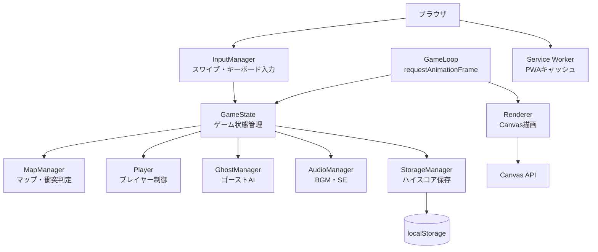
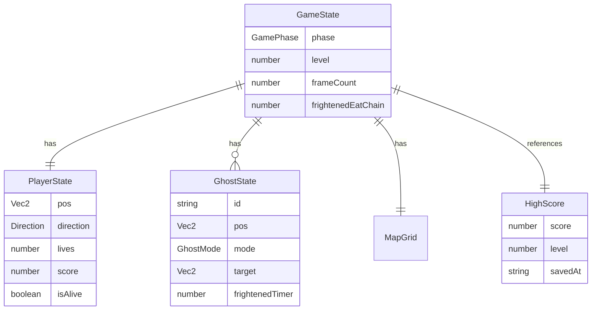
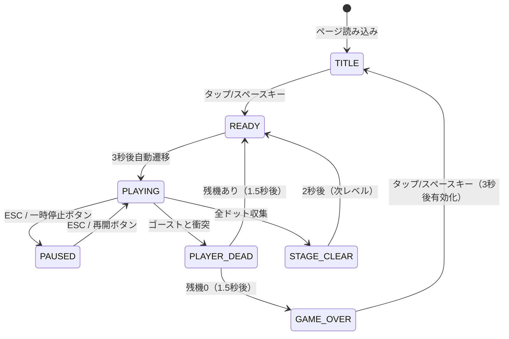

# 機能設計書 (Functional Design Document)

## システム構成図



---

## 技術スタック

| 分類 | 技術 | 選定理由 |
|------|------|----------|
| 言語 | TypeScript 5.x | 型安全性・IDEサポート・コンパイル後はゼロランタイム依存 |
| レンダリング | Canvas API | フレームレート制御が容易・ゲーム描画に最適 |
| ビルド | tsc（TypeScript Compiler） | ランタイム依存ゼロ・外部バンドラー不要 |
| ストレージ | localStorage | サーバー不要・ブラウザ標準 |
| ホスティング | GitHub Pages | 無料・静的配信 |
| PWA | manifest.json + service-worker.js | ホーム画面追加・オフライン対応 |
| サウンド | Web Audio API / HTML Audio | ブラウザ標準・ライブラリ不要 |

---

## データモデル定義

### エンティティ: Vec2（座標）

```typescript
interface Vec2 {
  x: number;  // タイル列インデックス
  y: number;  // タイル行インデックス
}
```

---

### エンティティ: TileType（マップタイル種別）

```typescript
type TileType =
  | 'WALL'          // 壁
  | 'DOT'           // 通常ドット (10点)
  | 'POWER_PELLET'  // パワーエサ (50点)
  | 'EMPTY'         // 通路（ドットなし）
  | 'GHOST_HOUSE'   // ゴーストハウス内部
  | 'GHOST_DOOR';   // ゴーストハウス出口
```

---

### エンティティ: Direction（移動方向）

```typescript
type Direction = 'UP' | 'DOWN' | 'LEFT' | 'RIGHT' | 'NONE';
```

---

### エンティティ: PlayerState

```typescript
interface PlayerState {
  pos: Vec2;             // 現在タイル座標
  pixelPos: Vec2;        // ピクセル単位の座標（スムーズ移動用）
  direction: Direction;  // 現在の移動方向
  nextDirection: Direction; // 次の移動方向（入力バッファ）
  lives: number;         // 残機数（初期値: 3）
  score: number;         // 現在スコア
  isAlive: boolean;      // 生存フラグ
}
```

**制約**:
- `lives` は 0〜5 の整数
- `score` は 0 以上の整数

---

### エンティティ: GhostMode

```typescript
type GhostMode =
  | 'SCATTER'    // 散開（自分のコーナーへ向かう）
  | 'CHASE'      // 追跡（プレイヤーを狙う）
  | 'FRIGHTENED' // イジケ（パワーエサ後）
  | 'EATEN'      // 食べられた（目だけの状態でハウスへ帰還）
  | 'HOUSE'      // ゴーストハウス内待機
  | 'LEAVING';   // ゴーストハウス脱出中
```

---

### エンティティ: GhostState

```typescript
interface GhostState {
  id: 'BLINKY' | 'PINKY' | 'INKY' | 'CLYDE';
  pos: Vec2;           // 現在タイル座標
  pixelPos: Vec2;      // ピクセル単位の座標
  direction: Direction;
  mode: GhostMode;
  target: Vec2;        // 現在のターゲットタイル
  frightenedTimer: number; // イジケ残りフレーム数
  releaseTimer: number;    // ハウスからの放出タイマー
  eatScore: number;        // 連鎖食べスコア (200/400/800/1600)
}
```

---

### エンティティ: GameState

```typescript
interface GameState {
  phase: GamePhase;     // 現在のゲームフェーズ
  player: PlayerState;
  ghosts: GhostState[]; // 4体固定
  map: TileType[][];    // 28列 × 31行のグリッド
  dotsRemaining: number; // 残ドット数
  level: number;        // 現在レベル（1始まり）
  highScore: number;    // ハイスコア（localStorage から読み込み）
  frameCount: number;   // 総フレームカウント（タイマー管理用）
  frightenedEatChain: number; // 連鎖食べカウント（0〜4）
}

type GamePhase =
  | 'TITLE'       // タイトル画面
  | 'READY'       // ゲーム開始前カウントダウン
  | 'PLAYING'     // プレイ中
  | 'PAUSED'      // 一時停止
  | 'PLAYER_DEAD' // プレイヤー死亡アニメーション
  | 'STAGE_CLEAR' // ステージクリアアニメーション
  | 'GAME_OVER';  // ゲームオーバー画面
```

---

### エンティティ: HighScore（localStorage）

```typescript
interface HighScore {
  score: number;   // ハイスコア
  level: number;   // 到達レベル
  savedAt: string; // ISO 8601 日時文字列
}
```

**保存キー**: `maze-runner:highscore`

---

### ER図



---

## コンポーネント設計

### GameLoop

**責務**: ゲームループの管理（更新・描画の駆動）

```typescript
class GameLoop {
  private lastTimestamp: number;
  private accumulator: number;
  private readonly FIXED_STEP: number; // = 1000/60 ms

  start(): void;        // requestAnimationFrame を開始
  stop(): void;         // ループ停止
  private tick(timestamp: number): void; // 毎フレーム呼ばれる内部メソッド
}
```

**依存関係**: GameState, Renderer

---

### MapManager

**責務**: マップデータの管理・衝突判定・ドット管理

```typescript
class MapManager {
  getInitialMap(): TileType[][];       // ステージ初期マップを返す
  isWall(map: TileType[][], pos: Vec2): boolean;
  canMove(map: TileType[][], pos: Vec2, dir: Direction): boolean;
  collectDot(state: GameState, pos: Vec2): number; // 得点を返す、マップを更新
  getTeleportExit(pos: Vec2): Vec2 | null;          // トンネルのワープ処理
  countDots(map: TileType[][]): number;
}
```

**依存関係**: GameState

---

### Player

**責務**: プレイヤーの移動・入力反映・ドット収集

```typescript
class Player {
  update(state: GameState, mapManager: MapManager): void;
  // - nextDirection を反映できるか確認し、可能なら direction を更新
  // - pixelPos を direction に沿って速度分進める
  // - タイル境界を通過したら collectDot を呼ぶ
  // - トンネルワープ処理

  getSpeed(level: number): number; // レベルに応じた速度（ピクセル/フレーム）
}
```

**依存関係**: MapManager

---

### GhostManager

**責務**: 4体ゴーストの AI・移動・モード管理

```typescript
class GhostManager {
  update(state: GameState, mapManager: MapManager): void;
  // - 各ゴーストの releaseTimer/frightenedTimer を更新
  // - モード（SCATTER/CHASE）のグローバルタイマーで切り替え
  // - 各ゴーストの target を計算
  // - 交差点で target に近い方向を選択して移動

  private getBlinkyTarget(state: GameState): Vec2;
  private getPinkyTarget(state: GameState): Vec2;
  private getInkyTarget(state: GameState): Vec2;
  private getClydeTarget(state: GameState): Vec2;
  private chooseDirection(ghost: GhostState, map: TileType[][], target: Vec2): Direction;
  private checkPlayerCollision(state: GameState): void;
}
```

**依存関係**: MapManager, GameState

---

### Renderer

**責務**: Canvas への全描画

```typescript
class Renderer {
  constructor(canvas: HTMLCanvasElement);

  render(state: GameState): void;
  // - clearRect でクリア
  // - drawMap / drawDots / drawPowerPellets
  // - drawPlayer（アニメーション付き）
  // - drawGhosts（モードに応じた色・点滅）
  // - drawHUD（スコア・残機・レベル）
  // - drawOverlay（READY / GAME_OVER / STAGE_CLEAR テキスト）

  private drawMap(state: GameState): void;
  private drawHUD(state: GameState): void;
  private drawPlayer(player: PlayerState, frame: number): void;
  private drawGhost(ghost: GhostState, frame: number): void;
}
```

**依存関係**: GameState

---

### InputManager

**責務**: キーボード・スワイプ入力の検出と方向変換

```typescript
class InputManager {
  private touchStartPos: Vec2 | null;
  private readonly SWIPE_THRESHOLD = 30; // px

  onDirectionInput: (dir: Direction) => void; // コールバック

  init(): void;   // addEventListener を登録
  destroy(): void; // removeEventListener

  private handleKeyDown(e: KeyboardEvent): void;
  private handleTouchStart(e: TouchEvent): void;
  private handleTouchEnd(e: TouchEvent): void;
  private calcSwipeDirection(start: Vec2, end: Vec2): Direction | null;
}
```

**依存関係**: なし（純粋な入力ハンドラ）

---

### AudioManager

**責務**: BGM・SE の再生制御

```typescript
class AudioManager {
  private bgm: HTMLAudioElement;
  private sounds: Map<SoundKey, HTMLAudioElement>;
  private muted: boolean;

  playBGM(): void;
  stopBGM(): void;
  playSE(key: SoundKey): void;
  toggleMute(): void;
  setMuted(muted: boolean): void;
}

type SoundKey =
  | 'dot'          // ドット収集
  | 'power_pellet' // パワーエサ収集
  | 'eat_ghost'    // ゴースト食べ
  | 'player_death' // プレイヤー死亡
  | 'stage_clear'  // ステージクリア
  | 'game_start';  // ゲーム開始
```

**依存関係**: なし

---

### StorageManager

**責務**: ハイスコアの永続化

```typescript
class StorageManager {
  private readonly KEY = 'maze-runner:highscore';

  loadHighScore(): number;
  saveHighScore(score: number, level: number): void;
  clearHighScore(): void;
}
```

**依存関係**: なし

---

## アルゴリズム設計

### ゴーストAI: ターゲット計算

ゴーストは毎フレーム「ターゲットタイル」を更新し、交差点で最もターゲットに近い方向を選択する。
（Pac-Man の原作アルゴリズムに準拠）

#### Blinky（赤）— 直接追跡

```typescript
function getBlinkyTarget(state: GameState): Vec2 {
  return { ...state.player.pos };
}
```

#### Pinky（ピンク）— 先読み4タイル

```typescript
function getPinkyTarget(state: GameState): Vec2 {
  const { pos, direction } = state.player;
  const offset = directionToVec2(direction, 4);
  return { x: pos.x + offset.x, y: pos.y + offset.y };
}
```

**注意**: 原作では UP 方向に4タイル先読み時に左にも4タイルずれるバグがある。忠実再現のためこのバグを含める（設計上の意図的再現）。

#### Inky（青）— 挟み撃ち

```typescript
function getInkyTarget(state: GameState, blinkyPos: Vec2): Vec2 {
  const { pos, direction } = state.player;
  const pivotOffset = directionToVec2(direction, 2);
  const pivot = { x: pos.x + pivotOffset.x, y: pos.y + pivotOffset.y };
  // pivot を中心に Blinky の位置を対称反転
  return {
    x: pivot.x * 2 - blinkyPos.x,
    y: pivot.y * 2 - blinkyPos.y,
  };
}
```

#### Clyde（オレンジ）— 距離依存切り替え

```typescript
const CLYDE_SCATTER_CORNER: Vec2 = { x: 0, y: 30 }; // 左下コーナー

function getClydeTarget(state: GameState, clydePos: Vec2): Vec2 {
  const dist = chebyshevDistance(clydePos, state.player.pos);
  if (dist > 8) {
    return { ...state.player.pos }; // 追跡
  }
  return { ...CLYDE_SCATTER_CORNER }; // 離散
}
```

---

### ゴーストAI: 交差点での方向選択

```typescript
function chooseDirection(
  ghostPos: Vec2,
  currentDir: Direction,
  target: Vec2,
  map: TileType[][]
): Direction {
  const candidates: Direction[] = ['UP', 'LEFT', 'DOWN', 'RIGHT'];
  const reverseDir = getOpposite(currentDir);

  let bestDir: Direction = currentDir;
  let bestDist = Infinity;

  for (const dir of candidates) {
    if (dir === reverseDir) continue; // 逆走禁止
    const next = move(ghostPos, dir);
    if (isWall(map, next)) continue;  // 壁は除外
    if (isGhostHouseDoor(map, next) && mode !== 'LEAVING') continue; // ゴーストドア通過制限

    const dist = euclideanDistanceSq(next, target);
    if (dist < bestDist) {
      bestDist = dist;
      bestDir = dir;
    }
  }
  return bestDir;
}
```

**判定優先度**: 距離が等しい場合は UP > LEFT > DOWN > RIGHT の優先順位を適用（原作準拠）。

---

### モード切替スケジュール（レベル1）

| フェーズ | モード | 持続フレーム数（60fps基準） |
|---------|--------|--------------------------|
| 1 | SCATTER | 420（7秒） |
| 2 | CHASE | 1200（20秒） |
| 3 | SCATTER | 420（7秒） |
| 4 | CHASE | 1200（20秒） |
| 5 | SCATTER | 300（5秒） |
| 6 | CHASE | 1200（20秒） |
| 7 | SCATTER | 300（5秒） |
| 8 | CHASE | 無限 |

パワーエサ取得時は全ゴーストが FRIGHTENED モードに移行（300フレーム = 5秒）。

---

### ゴースト放出タイマー（レベル1）

| ゴースト | 放出タイミング |
|---------|--------------|
| Blinky | ゲーム開始時に即座に出現 |
| Pinky | ゲーム開始時に即座に出現 |
| Inky | ドット30個収集後 |
| Clyde | ドット90個収集後（全体の約1/3） |

---

## 画面遷移図



---

## UI設計

### Canvasレイアウト

```
┌─────────────────────────┐
│ HI: 99999  SCORE: 12340 │  ← HUD行（上部）
├─────────────────────────┤
│                         │
│   [  迷路フィールド  ]   │  ← 28×31 タイルグリッド
│   28列 × 31行           │
│                         │
├─────────────────────────┤
│  ●●● LEVEL: 3          │  ← 残機・レベル表示（下部）
└─────────────────────────┘
```

**タイルサイズ**: スマホ幅に応じて `tileSize = Math.floor(screenWidth / 28)` で動的計算。

---

### カラーコーディング

| 対象 | 色 |
|------|-----|
| 壁 | `#2121DE`（原作青） |
| ドット | `#FFB8AE`（ピンクがかった白） |
| パワーエサ | `#FFB8AE`（点滅） |
| プレイヤー | `#FFE000`（黄） |
| Blinky | `#FF0000`（赤） |
| Pinky | `#FFB8FF`（ピンク） |
| Inky | `#00FFFF`（シアン） |
| Clyde | `#FFB852`（オレンジ） |
| イジケ（通常） | `#0000FF`（青） |
| イジケ（点滅） | `#FFFFFF`（白）⇔ `#0000FF`（青） |
| 背景 | `#000000`（黒） |

---

### オーバーレイテキスト

| フェーズ | 表示テキスト | 表示位置 |
|---------|------------|---------|
| READY | `READY!`（黄） | 中央 |
| GAME_OVER | `GAME OVER`（赤） | 中央 |
| STAGE_CLEAR | `STAGE CLEAR!`（シアン） | 中央 |
| PAUSED | `PAUSED`（白） | 中央 |

---

## ファイル構造

```
/
├── index.html            # エントリポイント・Canvas 要素
├── manifest.json         # PWA マニフェスト
├── service-worker.js     # PWA キャッシュ（コンパイル後静的ファイルをキャッシュ）
├── dist/
│   └── game.js           # tsc コンパイル後の単一バンドル
├── src/
│   ├── main.ts           # エントリポイント（Canvas取得・初期化）
│   ├── types.ts          # 共通型定義（Vec2, Direction, GameState等）
│   ├── constants.ts      # ゲーム定数（タイルサイズ、速度、スコア等）
│   ├── map.ts            # MapManager・初期マップデータ
│   ├── player.ts         # Player クラス
│   ├── ghost.ts          # GhostManager・Ghost AI
│   ├── renderer.ts       # Renderer クラス
│   ├── input.ts          # InputManager クラス
│   ├── audio.ts          # AudioManager クラス
│   ├── storage.ts        # StorageManager クラス
│   └── gameLoop.ts       # GameLoop クラス・GameState 初期化
└── assets/
    ├── sounds/
    │   ├── bgm.mp3
    │   ├── dot.mp3
    │   ├── power_pellet.mp3
    │   ├── eat_ghost.mp3
    │   ├── player_death.mp3
    │   └── stage_clear.mp3
    └── icons/            # PWA アイコン (192×192, 512×512)
```

---

## パフォーマンス最適化

- **固定タイムステップ**: `requestAnimationFrame` + 固定 1/60 秒ステップで物理更新を分離し、フレームレート変動に依存しない動作を実現
- **部分再描画不使用**: ゲームループごとに全体を `clearRect` して再描画。迷路の静的部分は `offscreenCanvas` にキャッシュして `drawImage` で高速転送
- **タイル単位の当たり判定**: ピクセル単位ではなくタイル座標で判定し、計算コストを最小化
- **ゴーストパス選択の最適化**: 毎フレーム BFS を行わず、交差点通過時のみ方向を再計算

---

## セキュリティ考慮事項

- **XSS リスクなし**: ユーザー入力を DOM に描画せず、Canvas API にのみ渡す
- **外部通信なし**: API 呼び出し・fetch 一切なし。ハイスコアは localStorage のみ
- **サウンドオートプレイ制限対応**: BGM は必ずユーザーインタラクション後に再生開始する（`AudioContext.resume()` を使用）
- **localStorage サニタイズ**: 読み込み時は `JSON.parse` + 型チェックで不正値を排除し、デフォルト値にフォールバック

---

## エラーハンドリング

| エラー種別 | 処理 | ユーザーへの表示 |
|-----------|------|-----------------|
| Canvas 非対応ブラウザ | HTMLフォールバックメッセージ表示 | 「このブラウザはサポートされていません」 |
| localStorage 書き込み失敗 | サイレントに無視（ゲーム継続） | なし（ハイスコア保存は非必須） |
| BGM 読み込み失敗 | BGM なしで継続 | なし（SE のみ継続） |
| ゲームループ例外 | `cancelAnimationFrame` でループ停止、リセットボタン表示 | 「エラーが発生しました。タップでリセット」 |
| タッチイベント `preventDefault` ブロック | passive listener にフォールバック | なし |

---

## テスト戦略

### ユニットテスト
- MapManager: 衝突判定・ドット収集・ワープ処理
- GhostManager: 各ゴーストのターゲット計算ロジック
- InputManager: スワイプ方向計算（30px閾値・誤検知防止）
- StorageManager: ハイスコア保存・読み込み・不正値フォールバック

### 統合テスト
- ゲームループ1フレーム: update → render が正常に動作する
- スコア加算: ドット・パワーエサ・ゴースト連鎖食べでスコアが正しく加算される

### 手動テスト（E2E相当）
- スマホ実機（iPhone / Android）でのスワイプ操作の反応確認
- 全ドット収集 → ステージクリア遷移
- 残機0 → ゲームオーバー遷移
- ページリロード後にハイスコアが保持されること
- PWA インストール後のオフライン動作
