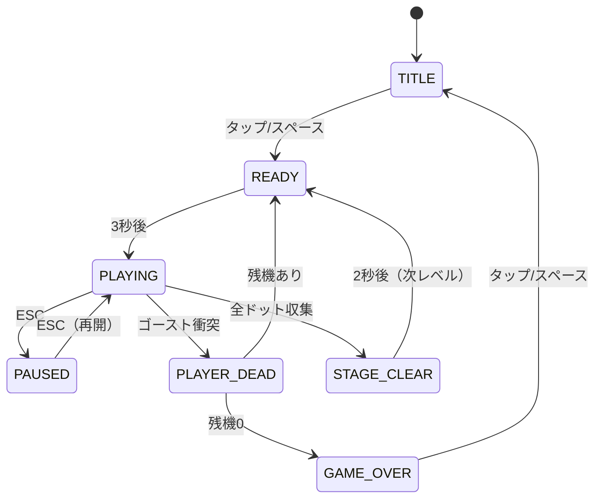

# プロジェクト用語集 (Glossary)

## 概要

このドキュメントは、迷宮ランプロジェクト内で使用される用語の定義を管理します。
ゲームドメイン用語・技術用語・略語を統一的に定義し、全ドキュメントで一貫した表記を保証します。

**更新日**: 2026-05-25

---

## ゲームドメイン用語

### 迷宮ラン

**定義**: 本プロジェクトで開発するパックマン風迷路ゲームのタイトル名。

**説明**: 著作権への配慮から「PAC-MAN」「パックマン」等の商標は使用しない。タイトル・キャラクター素材はすべてオリジナル。ゲームメカニクスのみ参考にする。

**英語表記**: Maze Runner

**関連用語**: [ドット](#ドット)、[ゴースト](#ゴースト)、[PWA](#pwa)

---

### ドット

**定義**: フィールドに配置された小さな点。プレイヤーが通過すると収集され 10 点加算される。

**説明**: 全ドットを収集するとステージクリアとなる。原作では「エサ」とも呼ばれる。

**関連用語**: [パワーエサ](#パワーエサ)、[ステージクリア](#ステージクリア)

**使用例**:
- 「残ドット数が 0 になるとステージクリア」
- `state.dotsRemaining` フィールドで残数を管理

**英語表記**: Dot

**実装箇所**: `src/map.ts`、`src/types.ts`（`TileType: 'DOT'`）

---

### パワーエサ

**定義**: フィールドの4隅付近に配置された大きな点。プレイヤーが収集すると 50 点加算され、一時的に[ゴースト](#ゴースト)を[イジケ状態](#イジケ状態)にする。

**説明**: 収集後の約 5 秒間（レベル 1: 300 フレーム）、ゴーストは青く点滅し、プレイヤーが食べることができる。

**関連用語**: [ドット](#ドット)、[イジケ状態](#イジケ状態)、[連鎖食べ](#連鎖食べ)

**英語表記**: Power Pellet

**実装箇所**: `src/types.ts`（`TileType: 'POWER_PELLET'`）、`src/constants.ts`（`FRIGHTENED_FRAMES`）

---

### ゴースト

**定義**: プレイヤーを追跡する敵キャラクター。4 体が存在し、それぞれ異なる AI を持つ。

**説明**: 各ゴーストは[散開モード](#ghostmode)と[追跡モード](#ghostmode)を交互に繰り返し、パワーエサ取得後は[イジケ状態](#イジケ状態)に移行する。

**各ゴーストの特徴**:

| 名前 | 色 | 行動パターン | 実装メソッド |
|------|-----|-------------|-------------|
| Blinky | 赤 | プレイヤーの現在位置を直接追跡 | `getBlinkyTarget()` |
| Pinky | ピンク | プレイヤーの進行方向 4 タイル先を狙う | `getPinkyTarget()` |
| Inky | 青 | Blinky とプレイヤーを組み合わせた挟み撃ち | `getInkyTarget()` |
| Clyde | オレンジ | 距離が 8 タイル未満なら逃げる、以上なら追跡 | `getClydeTarget()` |

**関連用語**: [イジケ状態](#イジケ状態)、[ゴーストハウス](#ゴーストハウス)、[GhostMode](#ghostmode)

**英語表記**: Ghost

**実装箇所**: `src/ghost.ts`（`GhostManager` クラス）

---

### イジケ状態

**定義**: パワーエサ収集後にゴーストが移行する特殊状態。青く点滅し、プレイヤーが食べることができる。

**説明**: 一定時間（レベル 1: 5 秒）が経過すると通常状態に戻る。残り時間が少なくなると青⇔白の点滅で警告を示す。

**関連用語**: [パワーエサ](#パワーエサ)、[連鎖食べ](#連鎖食べ)、[GhostMode](#ghostmode)

**英語表記**: Frightened State

**実装箇所**: `src/ghost.ts`、`src/types.ts`（`GhostMode: 'FRIGHTENED'`）

---

### 連鎖食べ

**定義**: 1 回のパワーエサ取得中に複数のゴーストを連続して食べたときのスコアボーナス体系。

**スコア**:
| 連鎖数 | 得点 |
|-------|------|
| 1 体目 | 200 点 |
| 2 体目 | 400 点 |
| 3 体目 | 800 点 |
| 4 体目 | 1600 点 |

**関連用語**: [イジケ状態](#イジケ状態)

**英語表記**: Eat Chain

**実装箇所**: `src/types.ts`（`GameState.frightenedEatChain`）

---

### ゴーストハウス

**定義**: ステージ中央に配置されたゴーストの待機エリア。ゲーム開始時にゴーストがここから出現する。

**説明**: 特定のドット収集数に達するとゴーストが一体ずつ放出される。食べられたゴーストは目の状態でここに戻り、通常状態として再出現する。

**関連用語**: [ゴースト](#ゴースト)、[GhostMode](#ghostmode)

**英語表記**: Ghost House

**実装箇所**: `src/types.ts`（`TileType: 'GHOST_HOUSE'`、`GhostMode: 'HOUSE' | 'LEAVING'`）

---

### 散開モード

**定義**: ゴーストが各自のコーナー（マップ四隅）へ向かうモード。追跡モードと交互に発生する。

**説明**: レベル 1 では 7 秒・20 秒・7 秒・20 秒・5 秒・20 秒・5 秒・無限（追跡）のスケジュールで切り替わる。

**関連用語**: [追跡モード](#追跡モード)、[GhostMode](#ghostmode)

**英語表記**: Scatter Mode

---

### 追跡モード

**定義**: ゴーストがプレイヤーを狙って動くモード。各ゴーストの AI アルゴリズムが発動する。

**関連用語**: [散開モード](#散開モード)、[GhostMode](#ghostmode)

**英語表記**: Chase Mode

---

### ステージクリア

**定義**: フィールドの全[ドット](#ドット)を収集したときの状態。次のレベルへ進む。

**関連用語**: [ゲームオーバー](#ゲームオーバー)、[GamePhase](#gamephase)

**英語表記**: Stage Clear

---

### ゲームオーバー

**定義**: 残機が 0 になった状態。スコアを確定し、タイトル画面に戻る。

**関連用語**: [残機](#残機)、[GamePhase](#gamephase)

**英語表記**: Game Over

---

### 残機

**定義**: プレイヤーが失敗できる残りの回数。初期値は 3 機。0 になるとゲームオーバー。

**説明**: ゴーストに触れると 1 機失い、スタート位置から再スタートする。

**英語表記**: Lives

**実装箇所**: `src/types.ts`（`PlayerState.lives`）

---

### ハイスコア

**定義**: プレイヤーがこれまでに達成した最高得点。`localStorage` に永続保存される。

**関連用語**: [スコア](#スコア)

**英語表記**: High Score

**実装箇所**: `src/storage.ts`（`StorageManager`）、`localStorage` キー: `maze-runner:highscore`

---

### スコア

**定義**: 現在のプレイセッションで獲得している得点。

**加算ルール**:
- ドット収集: 10 点
- パワーエサ収集: 50 点
- ゴースト食べ（連鎖ボーナスあり）: 200/400/800/1600 点

**関連用語**: [ハイスコア](#ハイスコア)

**英語表記**: Score

**実装箇所**: `src/types.ts`（`PlayerState.score`）

---

### タイル

**定義**: マップを構成する最小単位のグリッドセル。プレイヤーとゴーストの位置はタイル座標で管理される。

**説明**: マップは 28 列 × 31 行のグリッドで構成される。各タイルは[TileType](#tiletype)で種別が定義される。

**英語表記**: Tile

**関連用語**: [TileType](#tiletype)、[Vec2](#vec2)

---

### スワイプ操作

**定義**: スマートフォンのタッチ画面でプレイヤーの移動方向を入力する操作方法。

**仕様**:
- `touchstart` で開始座標を記録
- `touchend` で差分ベクトルを計算
- X・Y 差分の大きい方を意図した方向と判定
- 30px 未満の移動は無視（誤検知防止）
- `preventDefault()` でページスクロールを抑制

**英語表記**: Swipe Input

**実装箇所**: `src/input.ts`（`InputManager`）

---

## アーキテクチャ用語

### ゲームループパターン

**定義**: `requestAnimationFrame` を使ってフレームごとに Update（状態更新）→ Render（描画）を繰り返すゲーム設計パターン。

**本プロジェクトでの適用**:

```
requestAnimationFrame
    ↓
GameLoop.tick()
    ├── update() → GameState を更新
    └── render() → Canvas に描画
```

**固定タイムステップ**: 物理更新を 1/60 秒（16.67ms）固定ステップで行い、フレームレートの変動に依存しない動作を保証する。

**メリット**: フレームレートが落ちても物理挙動が変わらない

**関連コンポーネント**: `GameLoop`（`src/gameLoop.ts`）、`Renderer`（`src/renderer.ts`）

**関連ドキュメント**: [アーキテクチャ設計書](./architecture.md#アーキテクチャパターン)

---

### GameState

**定義**: ゲーム全体の状態を保持する単一の中央オブジェクト。Update フェーズのみが書き込みを行い、Render フェーズは読み取り専用で使用する。

**主要フィールド**:
- `phase`: 現在の[GamePhase](#gamephase)
- `player`: プレイヤー状態（位置・スコア・残機）
- `ghosts`: 4 体のゴースト状態配列
- `map`: タイルグリッド（`TileType[][]`）
- `dotsRemaining`: 残ドット数

**実装箇所**: `src/types.ts`（`GameState` インターフェース）

---

### Vec2

**定義**: 2 次元座標を表す型。タイル座標とピクセル座標の両方に使用される。

**型定義**:
```typescript
interface Vec2 {
  x: number;  // 列インデックス（タイル）またはピクセル X
  y: number;  // 行インデックス（タイル）またはピクセル Y
}
```

**使用区別**: 変数名に `Pos`（タイル座標）または `PixelPos`（ピクセル座標）を付けて区別する。

**実装箇所**: `src/types.ts`

---

### OffscreenCanvas（静的マップキャッシュ）

**定義**: 壁・床などの静的なマップ描画を事前にレンダリングしてキャッシュする非表示 Canvas。

**目的**: 毎フレームに静的部分を描画し直すコストを削減し、60fps を安定維持する。

**実装パターン**:
```typescript
// 初回のみ構築
if (!this.mapCache) this.mapCache = this.buildMapCache();
// 毎フレームは転送のみ
this.ctx.drawImage(this.mapCache, 0, 0);
```

**実装箇所**: `src/renderer.ts`

---

## 状態・ステータス定義

### GamePhase

**定義**: ゲーム全体のフェーズ（画面状態）を表すユニオン型。

| 値 | 意味 | 遷移条件 |
|----|------|---------|
| `TITLE` | タイトル画面 | 初回ロード / ゲームオーバーからの復帰 |
| `READY` | ゲーム開始前 | タップ/スペースキー押下後 |
| `PLAYING` | プレイ中 | READY から 3 秒後 / PAUSED から再開 |
| `PAUSED` | 一時停止 | PLAYING 中に ESC / 停止ボタン |
| `PLAYER_DEAD` | 死亡アニメーション中 | ゴーストと衝突 |
| `STAGE_CLEAR` | ステージクリアアニメーション | 全ドット収集 |
| `GAME_OVER` | ゲームオーバー画面 | 残機0での PLAYER_DEAD |

**状態遷移図**:



**実装箇所**: `src/types.ts`

---

### GhostMode

**定義**: 各ゴーストの行動モードを表すユニオン型。

| 値 | 意味 |
|----|------|
| `SCATTER` | [散開モード](#散開モード) - 自分のコーナーへ向かう |
| `CHASE` | [追跡モード](#追跡モード) - プレイヤーを狙う |
| `FRIGHTENED` | [イジケ状態](#イジケ状態) - 青く点滅、食べられる |
| `EATEN` | 食べられた状態 - 目のみでゴーストハウスへ帰還 |
| `HOUSE` | ゴーストハウス内待機 |
| `LEAVING` | ゴーストハウス脱出中 |

**実装箇所**: `src/types.ts`

---

### TileType

**定義**: マップの各セルの種別を表すユニオン型。

| 値 | 意味 |
|----|------|
| `WALL` | 壁（通過不可） |
| `DOT` | 通常ドット（収集で 10 点） |
| `POWER_PELLET` | パワーエサ（収集で 50 点 + イジケ発動） |
| `EMPTY` | 通路（ドットなし） |
| `GHOST_HOUSE` | ゴーストハウス内部 |
| `GHOST_DOOR` | ゴーストハウス出口（ゴーストのみ通過可） |

**実装箇所**: `src/types.ts`

---

### Direction

**定義**: 移動方向を表すユニオン型。

| 値 | 意味 |
|----|------|
| `UP` | 上方向 |
| `DOWN` | 下方向 |
| `LEFT` | 左方向 |
| `RIGHT` | 右方向 |
| `NONE` | 停止中 |

**実装箇所**: `src/types.ts`

---

## 技術用語

### TypeScript

**定義**: JavaScript に静的型付けを追加したプログラミング言語。

**本プロジェクトでの用途**: 全ソースコードを TypeScript で記述。コンパイル後はゼロランタイム依存の JS として動作。

**バージョン**: 5.x

**選定理由**: 型安全性によるゲームロジックのバグ防止・IDE 補完による開発効率向上

**設定ファイル**: `tsconfig.json`

**関連ドキュメント**: [アーキテクチャ設計書](./architecture.md)

---

### Canvas API

**定義**: ブラウザ標準の 2D/3D グラフィックス描画 API。`<canvas>` 要素上に JavaScript でピクセル単位の描画を行う。

**本プロジェクトでの用途**: ゲーム全体の描画（マップ・プレイヤー・ゴースト・HUD）を担当。

**採用理由**: ゲームループと相性が良く、外部ライブラリ不要でフレームレート制御が容易。

**実装箇所**: `src/renderer.ts`（`Renderer` クラス）

---

### Vitest

**定義**: TypeScript ネイティブ対応の高速テストフレームワーク。Jest 互換 API を持つ。

**本プロジェクトでの用途**: ゲームロジック（ゴースト AI・衝突判定・スコア計算等）のユニットテスト。

**バージョン**: 最新安定版

**設定ファイル**: `vitest.config.ts`（または `package.json` の `"test"` フィールド）

**関連ドキュメント**: [開発ガイドライン](./development-guidelines.md#テスト戦略)

---

### Web Audio API

**定義**: ブラウザ標準のオーディオ処理 API。音声の再生・加工・制御を JavaScript から行う。

**本プロジェクトでの用途**: BGM・SE の再生制御、ユーザーインタラクション後の `AudioContext.resume()` によるオートプレイ制限対応。

**実装箇所**: `src/audio.ts`（`AudioManager` クラス）

---

### localStorage

**定義**: ブラウザに組み込まれたキーバリューストア。オリジン単位でデータを永続保存する。

**本プロジェクトでの用途**: ハイスコアの保存。キー: `maze-runner:highscore`

**制約**: 文字列のみ保存可能（JSON にシリアライズして保存）。読み込み時は型チェックとフォールバックが必須。

**実装箇所**: `src/storage.ts`（`StorageManager` クラス）

---

### ES Modules（ESM）

**定義**: JavaScript の標準モジュールシステム。`import`/`export` 構文でファイル間の依存を管理する。

**本プロジェクトでの用途**: `<script type="module">` でブラウザがネイティブに読み込む。バンドラー不要。

**採用理由**: tsc の出力をそのままブラウザで動かせるため、ビルドステップを最小化できる。

---

## 略語・頭字語

### PWA

**正式名称**: Progressive Web App

**意味**: Web 技術で構築されたアプリをネイティブアプリのように使えるようにする仕組み。

**本プロジェクトでの使用**: `manifest.json` + `service-worker.js` によりスマホのホーム画面に追加してオフラインで起動できる。

**実装ファイル**: `manifest.json`、`service-worker.js`

---

### BGM

**正式名称**: Background Music

**意味**: ゲーム中に流れる背景音楽。

**本プロジェクトでの使用**: フリー素材の MP3 ファイルを使用。ブラウザの自動再生ポリシーに対応するため、最初のユーザーインタラクション後に再生開始。

**実装箇所**: `src/audio.ts`、`assets/sounds/bgm.mp3`

---

### SE

**正式名称**: Sound Effect

**意味**: ゲーム内の各アクションに対応する効果音。

**本プロジェクトでの使用**: ドット収集・パワーエサ収集・ゴースト食べ・プレイヤー死亡・ステージクリア・ゲーム開始の 6 種。

**実装箇所**: `src/audio.ts`、`assets/sounds/`

---

### FPS

**正式名称**: Frames Per Second

**意味**: 1 秒間に描画するフレーム数。

**本プロジェクトでの目標**: 60fps を安定維持。[固定タイムステップ](#ゲームループパターン)により物理更新を 1/60 秒で固定。

---

### CSP

**正式名称**: Content Security Policy

**意味**: ブラウザに読み込まれるリソースの制限を HTTP ヘッダーまたは `<meta>` タグで指定するセキュリティ機能。

**本プロジェクトでの使用**: GitHub Pages は HTTP ヘッダーのカスタマイズが不可のため、`<meta>` タグで設定。インラインスクリプトと外部 CDN を禁止。

---

## 索引

### あ行
- [イジケ状態](#イジケ状態) - ゲームドメイン用語

### か行
- [ゴースト](#ゴースト) - ゲームドメイン用語
- [ゴーストハウス](#ゴーストハウス) - ゲームドメイン用語
- [ゲームオーバー](#ゲームオーバー) - ゲームドメイン用語

### さ行
- [散開モード](#散開モード) - ゲームドメイン用語
- [残機](#残機) - ゲームドメイン用語
- [スコア](#スコア) - ゲームドメイン用語
- [スワイプ操作](#スワイプ操作) - ゲームドメイン用語
- [ステージクリア](#ステージクリア) - ゲームドメイン用語

### た行
- [タイル](#タイル) - ゲームドメイン用語
- [追跡モード](#追跡モード) - ゲームドメイン用語

### な行
- [迷宮ラン](#迷宮ラン) - ゲームドメイン用語

### は行
- [ハイスコア](#ハイスコア) - ゲームドメイン用語
- [パワーエサ](#パワーエサ) - ゲームドメイン用語

### ら行
- [連鎖食べ](#連鎖食べ) - ゲームドメイン用語

### A-Z・数字
- [Canvas API](#canvas-api) - 技術用語
- [CSP](#csp) - 略語
- [Direction](#direction) - 状態定義
- [ES Modules](#es-modulesesm) - 技術用語
- [FPS](#fps) - 略語
- [GamePhase](#gamephase) - 状態定義
- [GameState](#gamestate) - アーキテクチャ用語
- [GhostMode](#ghostmode) - 状態定義
- [ゲームループパターン](#ゲームループパターン) - アーキテクチャ用語
- [localStorage](#localstorage) - 技術用語
- [BGM](#bgm) - 略語
- [OffscreenCanvas](#offscreencanvas静的マップキャッシュ) - アーキテクチャ用語
- [PWA](#pwa) - 略語
- [SE](#se) - 略語
- [TileType](#tiletype) - 状態定義
- [TypeScript](#typescript) - 技術用語
- [Vec2](#vec2) - アーキテクチャ用語
- [Vitest](#vitest) - 技術用語
- [Web Audio API](#web-audio-api) - 技術用語
